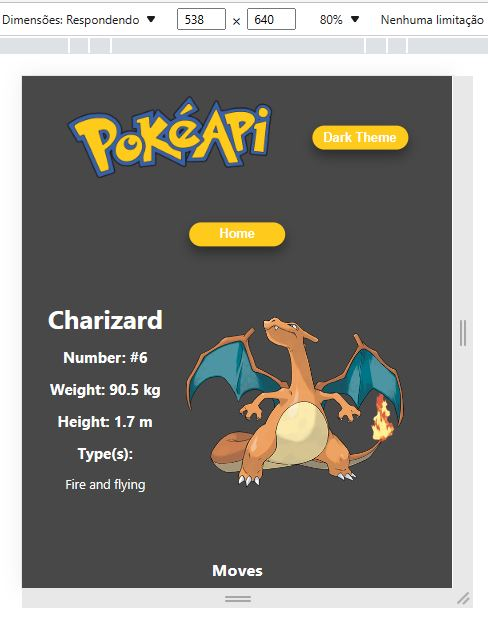

# Introdução

Este projeto é o último desafio do curso DEV QUEST.

Nosso objetivo é criar uma página que usa uma API RESTful e obter todos os dados de lá.

# Tecnologias

* REACT (Componentes de função com ganchos);
* Context API;
* React Router DOM;
* Styled Components;

# Começando

No diretório do projeto, você pode executar:
### `npm install`  e depois de ser instalado `npm start` para que o projeto seja executado

Executa o aplicativo no modo de desenvolvimento.\
Abre [http://localhost:3000](http://localhost:3000) para visualizá-lo em seu navegador.
A página será recarregada quando você fizer alterações.\

# Screenshots - Desktop

 

# Screenshots - Mobile

# Pokemon API

https://pokeapi.co/

# Vercel Link
